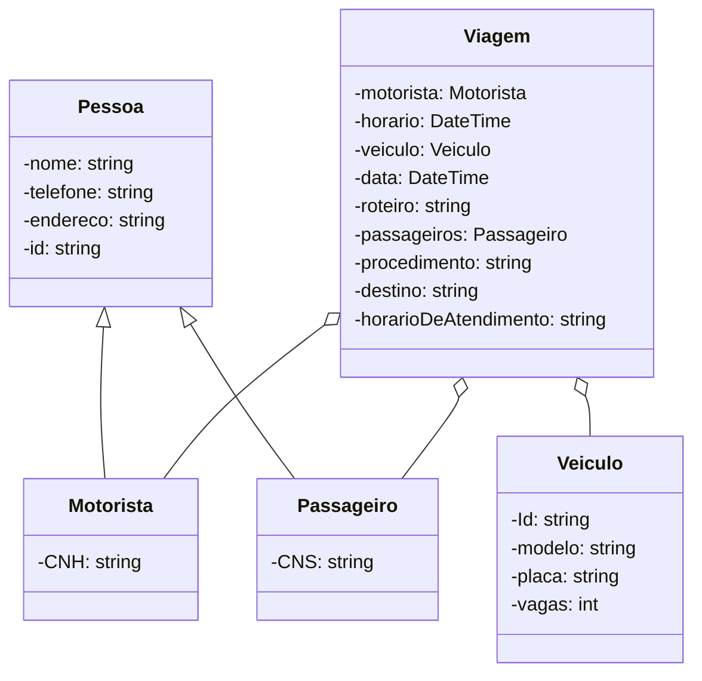
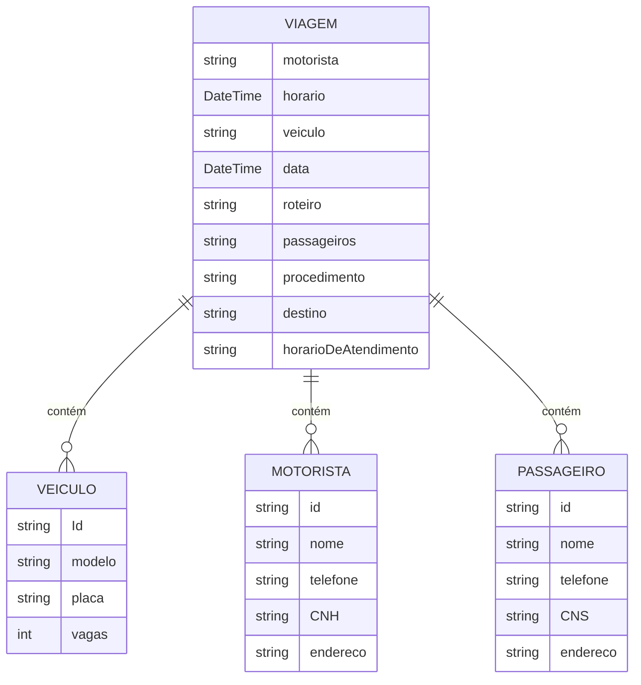

## Diagrama de classe

```mermaid
classDiagram
    Pessoa <|-- Motorista
    Pessoa <|-- Passageiro
    
    class Pessoa {
        -nome: string
        -telefone: string
        -endereco: string
        -id: string
    }

    class Motorista {
        -CNH: string
    }

    class Passageiro {
        -CNS: string
    }

    class Veiculo {
        -Id: string
        -modelo: string
        -placa: string
        -vagas: int
    }

    class Viagem {
        -motorista: Motorista
        -horario: DateTime
        -veiculo: Veiculo
        -data: DateTime
        -roteiro: string
        -passageiros: Passageiro
        -procedimento: string
        -destino: string
        -horarioDeAtendimento: string
    }

    Viagem o-- Veiculo
    Viagem o-- Motorista
    Viagem o-- Passageiro
```

## Diagrama Entidade Relacionamento

```mermaid
erDiagram
    MOTORISTA {
        string id
        string nome
        string telefone
        string CNH
        string endereco
    }

    PASSAGEIRO {
        string id
        string nome
        string telefone
        string CNS
        string endereco
    }

    VEICULO {
        string Id
        string modelo
        string placa
        int vagas
    }

    VIAGEM {
        string motorista
        DateTime horario
        string veiculo
        DateTime data
        string roteiro
        string passageiros
        string procedimento
        string destino
        string horarioDeAtendimento
    }

    VIAGEM ||--o{ VEICULO : "contém"
    VIAGEM ||--o{ MOTORISTA : "contém"
    VIAGEM ||--o{ PASSAGEIRO : "contém"
```
