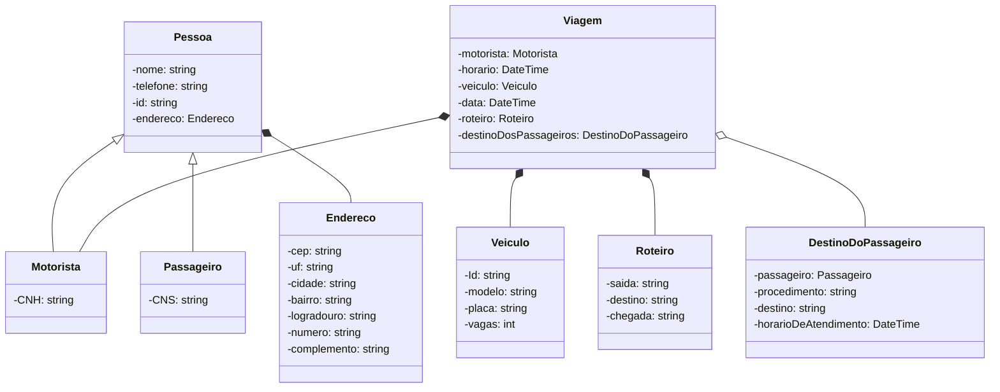
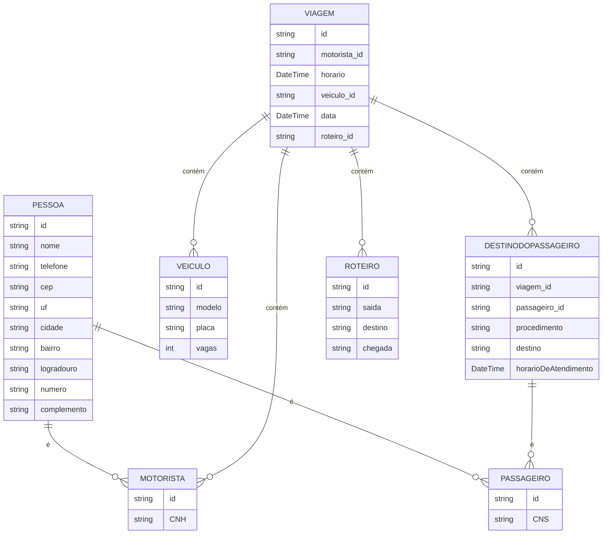

# ✅ Checklist Testável - API .NET com CQRS, Clean Architecture, EF Core, MediatR, JWT

---

## 🔹 Etapa 1: Criar Solução e Estrutura Base

- [x] Criar solution: dotnet new sln -n MyProject
- [x] Criar projetos:
  - [x] MyProject.API (Web API)
  - [x] MyProject.Core (Domínio e Interfaces)
  - [x] MyProject.Application (CQRS, DTOs, Validadores)
  - [x] MyProject.Infrastructure (EF Core, Repositórios, JWT)
- [x] Adicionar projetos à solution: dotnet sln add ...
- [x] Configurar referências:
  - [x] API → Application, Infrastructure
  - [x] Application → Core
  - [x] Infrastructure → Core

---

## 🔹 Etapa 2: Criar Entidades e Contratos (Core)

- [x] Criar entidade User em Core/Entities/User.cs
- [x] Criar construtores vazios em todas as entidades para não bugar o EF.
- [x] Criar pasta Repositories e interface IUserRepository.cs

---

## 🔹 Etapa 3: Criar DbContext e Repositório (Infrastructure)

- [x] Criar AppDbContext com DbSet<User>
- [x] Registrar DbContext no DI (Program.cs)
- [x] Instalar pacote nugget Microsoft.Extensions.Configuration.Json
- [x] Criar ContextFactory para evitar problemas com caminho de configurações.
- [x] Criar pasta Configurations para arquivos de mapeamento DB
- [x] Criar classes Configuration.cs para mapear chaves das entities necessarias.
- [x] Criar classes Repository implementando IRepository's
- [x] Registrar Repository's no DI
- [x] Criar e aplicar migrations:

dotnet ef migrations add SegundaMigration --project CONTRAVI.Infrascruture --startup-project CONTRAVI.API
dotnet ef database update --project CONTRAVI.Infrascruture --startup-project CONTRAVI.API

---

## 🔹 Etapa 4: Aplicar MediatR e CQRS (Application)

- [x] Instalar pacote MediatR
- [x] Criar pasta Users/Commands com:
  - [x] CreateUserCommand
  - [x] CreateUserHandler
- [x] Criar pasta Users/Queries com:
  - [x] GetAllUsersQuery
  - [x] GetAllUsersHandler
- [x] Criar pasta DTOs com UserDto
- [x] Registrar MediatR no Program.cs

---

## 🔹 Etapa 5: Configurar API

- [x] Criar UsersController com endpoints de GET e POST
- [x] Injetar IMediator e usar Send(command/query)
- [-] Rodar projeto e testar com Swagger/Postman
	- corrigir update passenger para receber apenas uma informação. (talvez)
	- 
---

## 🔹 Etapa 6: FluentValidation

- [ ] Instalar FluentValidation.AspNetCore
- [ ] Criar CreateUserValidator
- [ ] Registrar validações no Program.cs

---

## 🔹 Etapa 7: Autenticação e Autorização com JWT

- [ ] Instalar pacotes Microsoft.AspNetCore.Authentication.JwtBearer
- [ ] Criar AuthController para login
- [ ] Criar classe JwtService para geração de tokens
- [ ] Configurar autenticação no Program.cs
- [ ] Proteger rotas com [Authorize]

---

## 🔹 Etapa 8: Melhorias e Extras

- [ ] Criar camada de logs
- [ ] Criar testes unitários (ex: Handlers, Validations)
- [ ] Configurar versionamento de API
- [ ] Configurar Docker (opcional)
- [ ] Publicar em ambiente (Azure, Render, etc.)

---

## Dependências:
EntityFramewokr
- instalar global na maquina via cli: dotnet tool install --global dotnet-ef
- instalar em infrastructure: EntityFrameworkCore.SqlServer e EntityFrameworkCore.Tools

[Configuração inicial spring][doc].
## Diagrama de classe

## Diagrama Entidade Relacionamento

