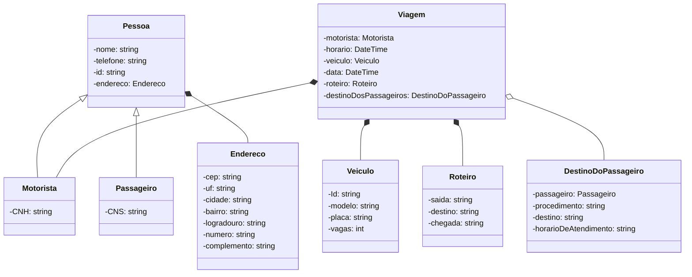
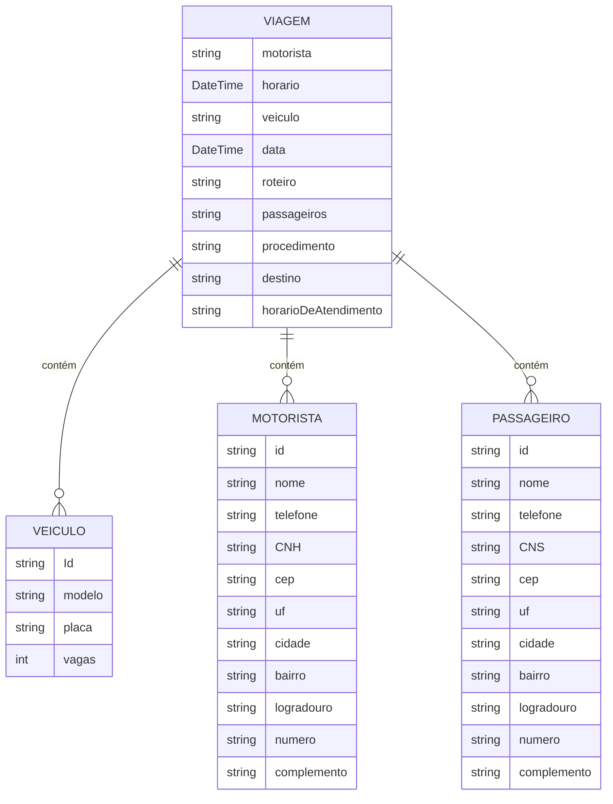

[doc]: https://start.spring.io/#!type=maven-project&language=java&platformVersion=3.3.1&packaging=jar&jvmVersion=17&groupId=com.contravi&artifactId=contravi&name=contravi&description=Gerenciar%20viagens%2C%20roteiros%20e%20passageiros.&packageName=com.contravi.contravi&dependencies=data-jpa,security,data-mongodb

[Configuração inicial spring][doc].
## Diagrama de classe

## Diagrama Entidade Relacionamento

